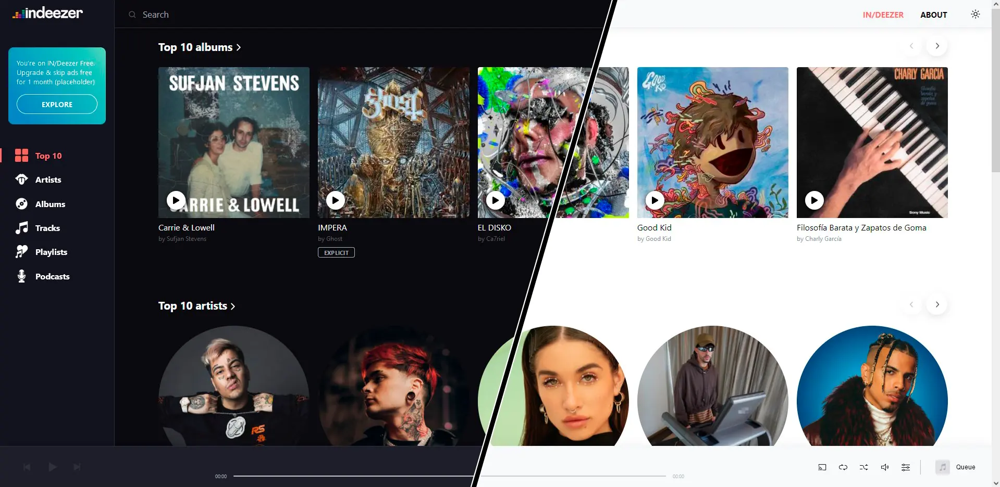
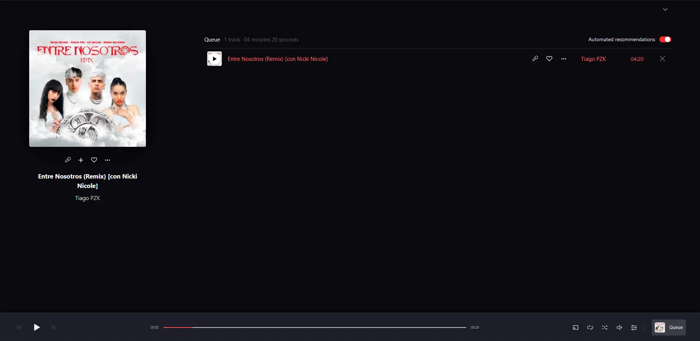

 

<b>IN/DEEZER</b> was conceive as an educational -personal- project. The idea behind it was to put into practice multiple concepts that I have learned -or tried to- during my journey as programmer and Software Developer, aswell adding some new tools to increase the challenge and keep the <b>learning process</b> interesting and engaging.

Even though this project started as a simple SPA to keep the learning curve low and steady, some <b>unexpected challenges</b> risen from curiosity:<i>What is a music-streaming site without a functional music player?</i> and the answer was:<b> an unfinished exercise!</b>. So from this question arose a self-imposed challenge: to build a functional audio player.

<h4>THE CHALLENGE</h4>

Building a custom audio player for this project came with two particular issues: first, masking the default audio player with MantineUI components was troublesome because of the opinionated styling method inherent to the component library; second, the audio player needed to keep its state during navigation so a global state manager was required; and third, the interactions between the audio player API and the new UI were of imperative nature, so tying the application state to the UI and the audio API was prone to side-effects.

All in all the new audio player ended up witb a -sometimes- convoluted but <b>functional solution, and the learning challenge, completed!</b>

 

<h1>Key Features.</h1>

This project is mock of an already existing french website -although now redisign- called <a href="https://www.deezer.com/us/channels/explore/" target="_blank" rel="nonreferrer">Deezer</a>. This site, and the project that I'm trying to emulate here, are above all music streaming site/webapps, so the key feature in these projects its the audio player solution. Setting all other features like playlist and track management, searching algorithms and the likes, listening to its music/podcasts its the project's fundamental feature.

<h2>Browse through the chart list</h2>

A detailed recreation of the -now old- Deezer's web design: from its layout and themes, to the behavior of the audio player.

<h2>Pick a track and listen!</h2>

Functional audio player! You can add tracks to the playlist and listen to a short preview of each track.

